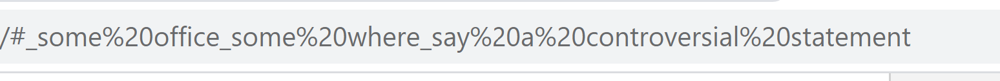
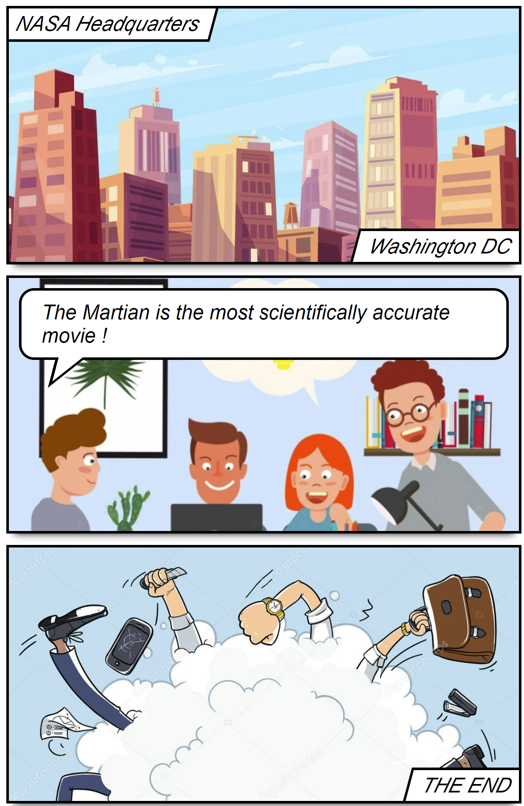

# Create fun comics straight from the browser's url

## To Run
* `npm install`
* `npm start`

## How it works ?

* Add text after the <bold>#</bold> (hashtag) fragment 
</img>

* Use <bold>_</bold> (underscore) as the text delimeter 

* Share the entire URL with your friends