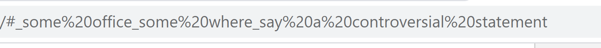
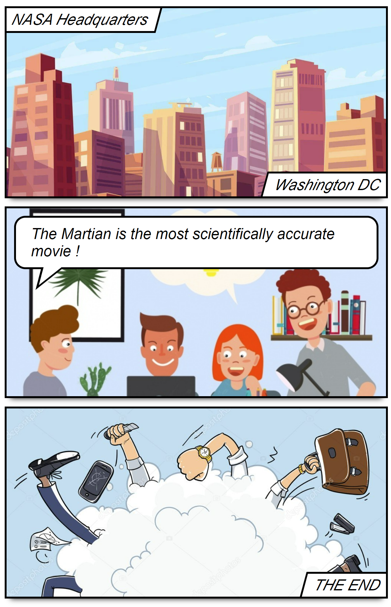

# Create fun comics straight from the browser's url

## To Run
* `npm install`
* `npm start`

## How it works ?

* Text after the <bold>#</bold> (hashtag) fragment is read from `window.location` and parsed
</img>

* Uses <bold>_</bold> (underscore) as the text delimeter for individual speech bubble.

* `?share=1` enables share mode for standalone view